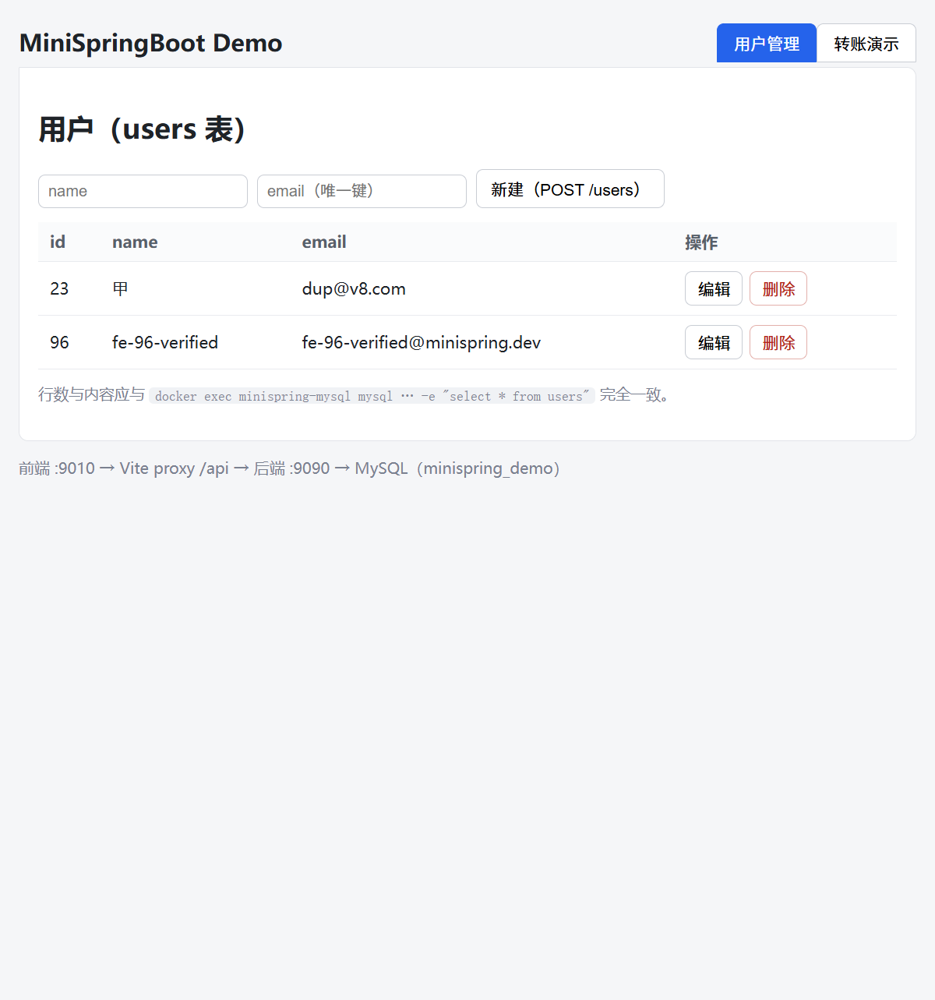
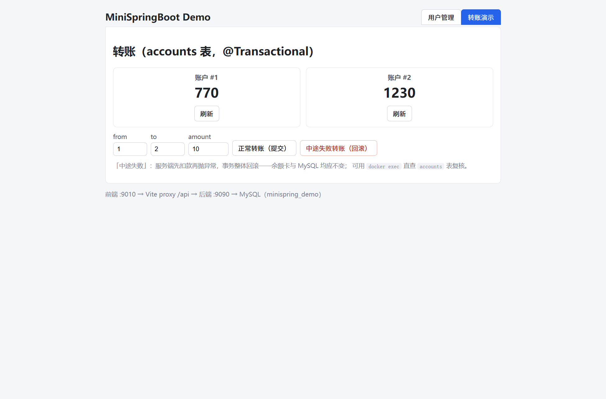
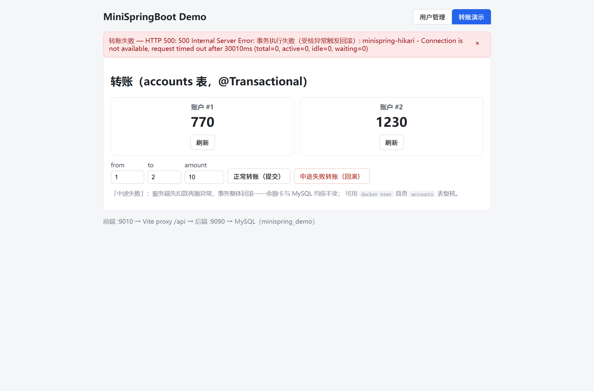
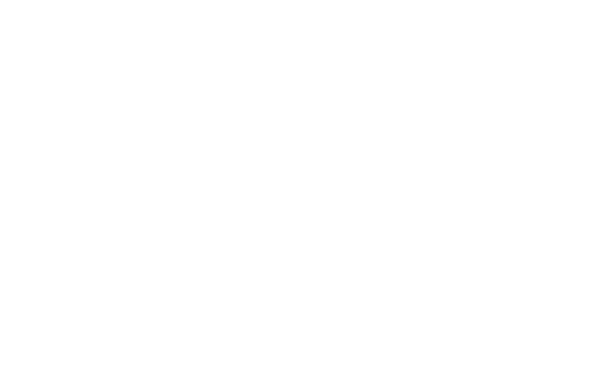

# MiniSpringBoot

> 假如这个世界上没有 Spring Boot，我们该怎么办？
> —— 那就从零把它造出来，把所有底层和内核拆开、摊平、写透。

[](https://github.com/NoctilumeDev/MiniSpringBoot/actions/workflows/ci.yml)


MiniSpringBoot 是一个 **从零手写** 的 Spring Boot 内核复刻项目。框架内核不依赖 Spring、不依赖任何第三方运行时库，只用 JDK 重新实现 Spring 家族最核心的那几块「魔法」：IoC 容器、AOP、Web/MVC、自动配置、外部化配置、JDBC 与声明式事务。

| | |
| :--- | :--- |
| 内核模块 | 8 个（core → config → context → aop → web → jdbc → autoconfigure → boot，依赖严格单向） |
| 内核代码 | 153 个 Java 文件 / 6,683 行（`src/main`，可 `git ls-files '**/*.java'` 复核） |
| 内核第三方运行时依赖 | **0**（JSON / YAML / HTTP 服务器全部手写；HikariCP、MySQL 驱动只在 demo 层） |
| 测试 | 69 个（本地与 [CI](https://github.com/NoctilumeDev/MiniSpringBoot/actions) 云端 MySQL 上均全绿；jdbc 单测真连库） |
| 里程碑 | M0–M9 落地验收通过 + 三轮全量复审（累计修复 41 个真实缺陷，账目见 [roadmap](docs/06-roadmap.md)） |

---

## ⚠️ 重要声明：内核是脚手架，demo 是真应用

请务必先认清它的身份——**框架内核是一个教学脚手架，不是开箱即用的生产框架**；但在它之上，我们搭了一个**真正能跑、能测的 demo 应用**（前端 + 后端 + MySQL 全链路），用来证明它「不是纸老虎」（3 实例 + Nginx 高可用为 M10 计划）。

- ❌ 框架内核不是「拿来即用」的生产框架，不内置分布式高可用
- ❌ 不追求 API 与 Spring 完全兼容，只追求「机制」与「思想」的一致
- ❌ 不会为了「能用」而牺牲「能被看懂」
- ✅ 但 demo 应用**一定要可用**：前端 + 后端 + 数据库全链路打通，并通过并发测试（3 实例高可用为 M10 计划，尚未落地）

它的目标是双重的：

1. 给 **底层爱好者** 一个能把每个环节看清楚、甚至打断点一步步跟进去的脚手架；
2. 用它**亲手造出来**的一套前端 + 后端 + 数据库 + 多实例部署，证明「从零造框架」这件事真的站得住。

> 麻雀虽小，五脏俱全。内核的验收标准是「工程级、商业级」完成度；demo 的验收标准是「真能用 + 全链路 + 高可用」。

---

## 它想回答什么问题

当你写下一个 `@SpringBootApplication`，然后点下运行按钮，背后到底发生了多少次魔法？大多数教程会用一句「Spring 自动帮你搞定了」一笔带过。MiniSpringBoot 拒绝这种含糊，它要亲手回答：

1. `@Component` 标注的类，是怎么被「扫描」出来、变成一个个 Bean 的？
2. 依赖注入（`@Autowired`）到底是怎么把对象塞进字段里的？循环依赖靠什么解开？
3. AOP 的切面，是怎么让你「无感」地加上了事务、日志、权限？
4. 一个 HTTP 请求，从 80 端口进来，是怎么精准命中到你的 Controller 方法的？
5. `spring.factories` / 自动配置，是如何做到「只引入一个 Starter 就生效一堆 Bean」的？
6. `application.yml` 里的一行配置，是怎么跑到你 `@Value` 标注的字段上的？

每一个问号，这里都有一份「自己写出来」的答案，而不是「调用了 Spring 某个类」的答案。

---

## 架构总览

MiniSpringBoot 采用与 Spring 对齐的分层设计。下面是**框架内核**的分层（从上到下，依赖方向严格单向，上层依赖下层）：

```
┌────────────────────────────────────────────────────────────────┐
│  boot          MiniSpringApplication.run() / Lifecycle 驱动 /   │
│                关闭钩子 / Banner / StartedEvent（不依赖 web）   │
├────────────────────────────────────────────────────────────────┤
│  autoconfigure @Conditional / SPI 读取 + 框架自动配置类归位     │
│                （web/aop/config 均 optional：裁掉即消失，       │
│                与 spring-boot-autoconfigure 实证结构一致）      │
├────────────────────────────────────────────────────────────────┤
│  web           DispatcherServlet / HandlerMapping / 参数绑定    │
│                （内嵌 HTTP 服务器，零第三方依赖；经 Lifecycle   │
│                由 boot 启动）                                   │
├────────────────────────────────────────────────────────────────┤
│  jdbc          JdbcTemplate / RowMapper / DataAccessException / │
│                编程式·声明式事务（@Transactional，纯 java.sql.*）│
├────────────────────────────────────────────────────────────────┤
│  aop           Pointcut / Advice / 动态代理 / 自动代理创建器    │
├────────────────────────────────────────────────────────────────┤
│  context       注解扫描 / @Configuration·@Bean / 事件 / Lifecycle│
├────────────────────────────────────────────────────────────────┤
│  config        Environment / PropertySource / @Value            │
├────────────────────────────────────────────────────────────────┤
│  core          BeanFactory / BeanDefinition / Bean 生命周期     │
│                BeanPostProcessor                                │
└────────────────────────────────────────────────────────────────┘
     —— 内核全部基于 JDK 17，零第三方运行时依赖 ——

  demo 轨道：mini-spring-demo（后端收口）/ mini-spring-starter-demo（Starter 验证）
           / demo-frontend（React 前端）/ deploy（MySQL 容器）
```

| 模块 | 对应 Spring 的概念 | 责任 |
| --- | --- | --- |
| `core` | spring-beans | Bean 定义、实例化、依赖注入、生命周期、循环依赖（三级缓存） |
| `config` | Environment / Binder | 配置文件解析（properties/yaml/Profile）、`@Value`、属性绑定 |
| `context` | spring-context | 注解扫描、配置类解析、`@ComponentScan`、事件广播、`Lifecycle` |
| `aop` | spring-aop | 切点匹配、通知执行、JDK 动态代理、自动代理创建器 |
| `web` | spring-webmvc + 内嵌容器 | HTTP 服务器、路由、参数绑定、响应序列化、静态资源 |
| `jdbc` | spring-jdbc + tx | JdbcTemplate、RowMapper、DataAccessException、编程式/声明式事务（纯 `java.sql.*`） |
| `autoconfigure` | spring-boot-autoconfigure | `@Conditional` 派生、SPI 装配、框架自动配置类归位（optional + name 探测） |
| `boot` | spring-boot | 启动入口（Lifecycle 驱动内嵌服务器）、事件、Banner |

> **双轨制**：上表是**框架内核**（零第三方依赖，用于教学）。在它之上还有一条「demo 应用」轨道——业务代码 + React 前端 + MySQL + Nginx，用它证明内核「真能用」，并跑通全链路、3 实例高可用。详见 [docs/architecture.md](docs/architecture.md)。

---

## 真能跑 —— 今日实拍

四张截图均为浏览器真实操作后截取（非 mock、非设计稿）：页面上的每条数据都同时在 MySQL 里直查得到（`docker exec minispring-mysql mysql ... minispring_demo` 三方对照），每一次写操作都真实落库。

| 用户管理（CRUD 落 MySQL） | 转账演示（事务提交 / 回滚） |
| :---: | :---: |
|  |  |
| 表中 id=23 / id=96 两行与 `users` 表逐行一致；新建、编辑、删除均真实落库（唯一键冲突会被 MySQL 约束拒绝并透出到 UI） | 余额卡 770 / 1230 即 `accounts` 表实时值；「中途失败转账」先扣款后抛异常 → 事务整体回滚，两账户分文不动 |

| 错误根因直达 UI（数据库断连） | 状态码语义（404，非一律 500） |
| :---: | :---: |
|  |  |
| `docker stop mysql` 后转账：约 30s 有限阻塞（Hikari connectionTimeout），红色横幅逐字透出根因与连接池状态（`Connection is not available, request timed out after 30010ms (total=0, active=0, idle=0)`）；事务开启失败即回滚，余额零变动；`docker start` 后接口立即自愈 | 资源缺失返回 404、参数非法返回 400（如负数转账金额）、业务规则冲突才是 500——异常到状态码的内建映射，调用方不再靠猜 |

> 以上四张图的取证过程（含断连前后 DB 快照差分）记录于 [docs/06-roadmap.md](docs/06-roadmap.md) 各轮验收章节。

---

## 设计哲学

本项目刻意选择了四条「不讨好」的原则，它们决定了整个代码库的气质：

### 1. 零依赖（内核）——造轮子本身就是目的

框架内核不引入 Spring、不引入 Jackson、不引入 Tomcat、不引入 YAML 库。JSON 解析、YAML 解析、HTTP 服务器，全部自己写。

这不代表「自己写的更好」，而是因为 **一个初学者只有亲手写过一个 HTTP 服务器，才真正理解 Spring Boot 内嵌的 Tomcat 到底替我们做了什么**。轮子不是用来省事的，而是用来理解「为什么需要这个轮子」的。

### 2. 剥洋葱——每一层都能被单独打开

在 Spring 里，很多机制被层层封装、工厂套工厂、代理套代理。MiniSpringBoot 刻意保持「扁平」：能用直白的 `if/else` 讲清楚，就绝不用晦涩的策略模式。**可读性优先于优雅性。**

### 3. 落地验收——不靠测试与日志，靠真实落地

一个里程碑算「过」，标准是**真实观察到的落地结果**：浏览器真打开、F12 真看到请求、数据库真查到数据、真进程真跑起来。**单测与日志只作最低基线，不作为验收依据。**

- 每个模块真实可运行，行为真实可观察（非 mock）
- 并发正确性：内嵌服务器多线程并发处理请求、数据库连接池无泄漏
- 一个能真正跑起来的示例应用 `demo`（React 前端 + 后端 + MySQL 全链路）
- 3 实例无状态 + Nginx 负载均衡的高可用演练（M10 计划）
- 每个里程碑都有明确的「落地证据」验收清单
- **每一轮全量复审都以 `docker exec` 直查 MySQL / 真实 HTTP / 浏览器操作为唯一事实**——「宣称已修 ≠ 代码事实」，登记关闭前逐项 grep 源码核实；修复必须配「修错了必失败」的约束性测试（往届复审曾揪出三级缓存残留、`@Import` 循环导入、监听器泛型静默退化等 20+ 真实缺陷，详见 [docs/06-roadmap.md](docs/06-roadmap.md) 各轮审查记录）

### 4. 不能牵一发动全身——接口契约

架构上强制「高内聚、低耦合」：跨模块只允许依赖下层**公开接口**，禁止触碰实现类；内部重构绝不改动接口签名。**只见树木不见森林，是本项目最不能犯的错误**——模块要有清晰的森林全局视角，局部改动不得波及全身。

---

## 目录结构

```
MiniSpringBoot
├── README.md
├── LICENSE                   # MIT
├── .github/workflows/ci.yml  # CI（backend: JDK17+MySQL service 真连库跑测试；frontend: Vite build）
├── docs/                      # 设计文档
│   ├── architecture.md        # 总体设计
│   ├── 01-ioc-container.md    # IoC 容器
│   ├── 02-aop.md              # AOP
│   ├── 03-web-mvc.md          # Web 与 MVC
│   ├── 04-auto-configuration.md # 自动配置与 Starter
│   ├── 05-externalized-configuration.md # 外部化配置
│   ├── 06-roadmap.md          # 路线图、技术债与验收标准（含各轮复审记录）
│   ├── 07-boot.md             # 启动器
│   ├── 08-jdbc.md             # JDBC 与事务
│   ├── 09-frontend.md         # React 前端与联调
│   └── screenshots/           # 联调验收实拍（README 引用）
├── mini-spring-core/          # 核心容器（三级缓存 / 生命周期 / BPP）
├── mini-spring-config/        # 配置系统（properties/yaml/Profile/@Value）
├── mini-spring-context/       # 注解扫描 / 配置类解析 / 事件
├── mini-spring-aop/           # AOP（JDK 动态代理，零第三方）
├── mini-spring-web/           # Web/MVC + 内嵌服务器 + 自写 JSON
├── mini-spring-jdbc/          # JDBC（JdbcTemplate / 事务，纯 java.sql.*）
├── mini-spring-autoconfigure/ # 自动配置（框架自动配置类统一归位于此）
├── mini-spring-boot/          # 启动器（run 自动起服务器 + 关闭钩子）
├── mini-spring-starter-demo/  # Starter 验证（引入依赖即自动装配）
├── mini-spring-demo/          # 后端 demo 收口（全链路能力验证）
├── demo-frontend/             # React + Vite 前端（M9 联调：用户管理 + 转账演示）
└── deploy/                    # 部署物（mysql：M8 数据库容器 compose + 建表 SQL；Nginx/压测 M10）
```

> React 前端已于 M9 落地（`demo-frontend/`，9010）；MySQL 于 M8 接入（`deploy/mysql/`）。

---

## 构建与运行

```bash
# 全量构建 + 测试（JDK 17；mini-spring-jdbc 单测真连 MySQL，需先起容器）
docker compose -f deploy/mysql/docker-compose.yml up -d   # MySQL 8（宿主 13306）
mvn clean test

# 启动后端 demo（一条 run() 拉起：自动配置 + AOP + 事件 + 数据源 + 内嵌服务器 9090 端口）
mvn -pl mini-spring-demo exec:java "-Dexec.mainClass=com.minispring.demo.app.DemoApplication"
```

验证：浏览器访问 `http://localhost:9090/hello`、`http://localhost:9090/users`（CRUD 落 MySQL）、`http://localhost:9090/accounts/1`（转账事务：`POST /accounts/transfer?from=1&to=2&amount=100`，`POST /accounts/transfer-fail` 回滚取证；资源缺失返回 404、参数非法返回 400）等接口。

```bash
# 启动前端（M9，另一终端；Vite 9010，/api 经 proxy 转 9090）
cd demo-frontend && npm install && npm run dev
```

验证：浏览器打开 `http://localhost:9010`——用户管理页对 MySQL 真实 CRUD、转账页可视化事务提交/回滚；F12 Network 可见 `/api/*` 全链路请求。

> 推送到 main 即触发 [GitHub Actions CI](.github/workflows/ci.yml)：backend 在云端起 MySQL service 跑全量 69 个测试（jdbc 单测真连库），frontend 跑 `npm ci && npm run build`——本地能跑的，云端同样验证。

---

## 能力一览（造了什么）

| 能力 | 教学实现（对标 Spring） | 落地状态 |
| --- | --- | --- |
| IoC 容器 | 三级缓存循环依赖、构造器/字段/方法注入、BeanPostProcessor、生命周期回调 | ✅ 真实 `run()` 拉起 |
| 外部化配置 | properties/yaml/Profile、`@Value`、占位符、同名 key 优先级 | ✅ 真实生效 |
| 注解扫描 | `@ComponentScan`、`@Configuration`/`@Bean`、复合/元注解递归 | ✅ 真实扫描 |
| 事件机制 | `ApplicationEvent`、`ApplicationListener` 泛型事件分发（接口式监听）、初始化期事件 | ✅ 真实按序触发 |
| AOP | JDK 动态代理、execution/`@annotation` 切点、Before/After/Around | ✅ 真实织入（事务/日志） |
| Web/MVC | 自写 HTTP 服务器 + JSON、`@RequestMapping` 及派生注解、路径模板、异常→状态码映射（404/400/500，`ResponseStatusException`） | ✅ 浏览器真实请求 |
| 自动配置 | `@Conditional` 派生、SPI 装配、optional 依赖裁剪即消失 | ✅ 分离 classpath 实证 |
| 启动器 | `MiniSpringApplication.run()`、Lifecycle 驱动、关闭钩子、Banner | ✅ 一条命令拉起全栈 |
| JDBC/事务 | JdbcTemplate、`DataAccessException` 体系、编程式 + `@Transactional` | ✅ 真连 MySQL 落库 |
| 前端联调 | React + Vite、proxy 同源、错误链路到 UI | ✅ 浏览器实拍（见上） |

---

## 路线图

完整里程碑见 [docs/06-roadmap.md](docs/06-roadmap.md)，概要如下：

- **M0** ✅：环境就绪 + 规矩冻结 + 方案审批
- **M1** ✅：IoC 容器（Bean 定义 → 实例化 → 注入 → 生命周期）
- **M2** ✅：注解与类路径扫描
- **M3** ✅：AOP（切点 + 通知 + 动态代理）
- **M4** ✅：外部化配置（`application.properties` / `application.yml` / `@Value`）
- **M5** ✅：Web/MVC + 内嵌服务器
- **M6** ✅：自动配置与 Starter
- **M7** ✅：启动器（run 自动起服务器）、事件机制、后端 demo 收口
- **M8** ✅：数据库接入（MySQL + HikariCP + JdbcTemplate + 声明式事务；V1~V10 唯一事实验收）
- **M9** ✅：React 前端 + 前后端联调（Vite proxy 同源；浏览器/Network/MySQL 三方对照验收）
- **M0–M9 三轮全量复审** ✅：外审 + 自审 + 他机环境复核，累计揪出并修复 40+ 真实缺陷（详见 [docs/06-roadmap.md](docs/06-roadmap.md) 各轮记录），测试 45→69
- **M10**：3 实例高可用 + 全链路终验

---

## 许可与致谢

本项目以 [MIT License](LICENSE) 开源。灵感与参照来自 Spring Framework 与 Spring Boot 的公开设计，向它们致以敬意——正是它们把 Java 生态带到了今天的高度，而我们要做的，是把它们的「黑盒」重新打开。

> 站在巨人的肩膀上，去拆解巨人的骨架。