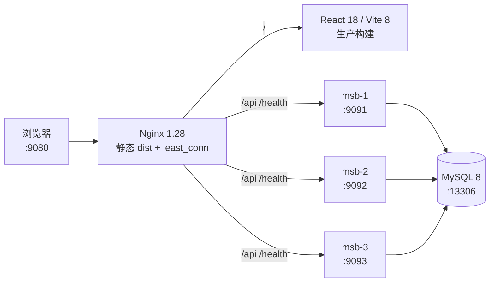

# 10 · M10 三实例高可用与有界容量验证

M10 把 M9 的单实例开发链路推进为一套可复现的本机生产形态：浏览器只访问 Nginx `:9080`，Nginx 同源托管 React `dist`，并以 `least_conn` 把 API 请求分发到三个 MiniSpringBoot 实例 `:9091/:9092/:9093`；三个实例共享 MySQL，但不共享进程内状态。

本章同时记录 **M10 自验证结论**与后续的 **VeriTrail 0.12 导入证据复验**。代码与原始证据契约冻结到源码提交 [`85c2b22`](https://github.com/NoctilumeDev/MiniSpringBoot/commit/85c2b22dfdcb17cd2527f068f85542aca25d694c)，并由专用标签 [`m10-evidence-source-v1`](https://github.com/NoctilumeDev/MiniSpringBoot/tree/m10-evidence-source-v1) 永久公开；该对象与主线等价提交 [`582b0f5`](https://github.com/NoctilumeDev/MiniSpringBoot/commit/582b0f53a57844c359724424b869c75088b61b50) 的 tree 均为 `137a0cebc49dca22508abd540c162c62f7edc5cd`，逐文件差异为 0，因此冻结证据无需改写。

证据清单见 [`docs/evidence/m10/m10-evidence-manifest.json`](evidence/m10/m10-evidence-manifest.json)；2026-08-24 又重新执行故障切换、事务和数据库就绪恢复，并由 VeriTrail 对原始证据哈希与新鲜回放事实执行 15 项 HARD 断言，裁决为 `PASS`。完整 Bundle 见 [`docs/evidence/m10/veritrail/bundle`](evidence/m10/veritrail/bundle)，复现说明见 [`docs/evidence/m10/veritrail/README.md`](evidence/m10/veritrail/README.md)，原始 M10 冻结坐标见 [`v0.m10`](https://github.com/NoctilumeDev/MiniSpringBoot/releases/tag/v0.m10)，独立审计正确性修订后的当前维护坐标见 [`v0.m10.2`](https://github.com/NoctilumeDev/MiniSpringBoot/releases/tag/v0.m10.2)。

这次复验的范围是 `IMPORTED_EVIDENCE_AUDIT`：VeriTrail 验证冻结事实和边界，但 Core 0.12 没有接管 Docker、Nginx、MySQL 与三个 Java 进程的完整生命周期，因此生命周期所有权仍明确为 `NOT_PROVEN`。这不是缩写成“全拓扑由 VeriTrail 托管”，也不能替代下面列出的单机与生产边界。

---

## 1. 运行拓扑



- `GET /health/live` 只证明 JVM 与 HTTP 链路存活，不访问外部资源。
- `GET /health` 会真实执行 `SELECT 1`，连接池或 MySQL 不可用时沿既有错误链返回 HTTP 500。
- Nginx 使用被动故障判定（`max_fails=1 fail_timeout=3s`）和有限重试；写请求没有启用 `non_idempotent`，避免连接失败时盲目重放 `POST/PUT/DELETE`。
- `X-MiniSpring-Upstream` 返回实际上游地址，压测报告据此核对三实例命中分布。

---

## 2. 启动、观察与停止

前置条件：Windows、JDK 17、Maven、Node.js 22、Docker Desktop；`minispring-mysql` 必须处于 `healthy`。M10 PowerShell 脚本同时通过 PowerShell 7 与 Windows PowerShell 5.1 解析。

```powershell
# 首次或源码变化后：构建后端/前端并启动完整集群
powershell.exe -NoProfile -ExecutionPolicy Bypass -File deploy/m10/start-cluster.ps1

# 浏览器打开 http://127.0.0.1:9080/
# 查看三实例、就绪探针与宿主资源快照
powershell.exe -NoProfile -ExecutionPolicy Bypass -File deploy/m10/status-cluster.ps1

# 只停止本脚本记录且经命令行/端口双重确认的 JVM，并移除 Nginx；MySQL 数据卷不动
powershell.exe -NoProfile -ExecutionPolicy Bypass -File deploy/m10/stop-cluster.ps1
```

运行状态、PID 与日志只写入被 Git 忽略的 `deploy/m10/.runtime/`。停止和故障注入前，脚本都会核对 PID 的 Java 主类与端口参数；若端口属于未知进程则拒绝操作，避免误杀本机其他服务。

---

## 3. 有界容量方法

容量验证不是无上限“轰炸”。脚本只打只读端点，阶梯为 `1 → 8 → 24 → 48 → 72`；每阶预热 30 秒、稳态 60 秒、间隔 5 秒，并同时采集吞吐、p50/p95/p99、HTTP 状态、实例分布、CPU 与可用内存。

硬止损线：

- 可用内存 `< 2 GiB`；
- CPU `≥ 85%` 持续 10 秒；
- 非预期错误率 `> 1%`；
- 任一条件触发即停止升阶并保存现场，不继续跑 96 并发。

正式结果（2026-08-22，i7-14650HX，24 逻辑处理器，15.78 GiB RAM）：

| 并发 | 请求数 | 吞吐 RPS | p50 | p95 | p99 | 错误率 | 峰值 CPU | 最低可用内存 |
| ---: | ---: | ---: | ---: | ---: | ---: | ---: | ---: | ---: |
| 1 | 56,312 | 938.51 | 1.05 ms | 1.50 ms | 1.88 ms | 0% | 39.4% | 3.653 GiB |
| 8 | 274,859 | 4,580.85 | 1.71 ms | 2.45 ms | 3.20 ms | 0% | 67.7% | 4.002 GiB |
| **24** | **376,558** | **6,275.64** | **3.75 ms** | **5.14 ms** | **6.29 ms** | **0%** | **77.5%** | **3.804 GiB** |
| 48 | 359,121 | 5,985.10 | 7.91 ms | 10.06 ms | 11.44 ms | 0% | 79.1% | 3.671 GiB |
| 72 | 349,348 | 5,822.26 | 12.21 ms | 15.17 ms | 16.95 ms | 0% | 79.8% | 3.547 GiB |

24 并发是这台单机的推荐运行上限：它取得最高吞吐；继续升到 48/72 时吞吐回落、延迟成倍上升，说明系统已进入收益递减区。48/72 只作为压力边界，不应被包装成日常并发能力；96 未运行。

复现命令：

```powershell
node deploy/m10/load/bounded-load.mjs --stages=1,8,24,48,72 --warmup-seconds=30 --duration-seconds=60 --rest-seconds=5 --min-free-memory-gib=2 --max-cpu-percent=85 --cpu-breach-seconds=10 --max-error-rate=0.01 --label=capacity-baseline
```

---

## 4. 故障、事务与就绪闭环

### 4.1 单实例故障切换

在 24 并发稳态中停止 `msb-2`，随后恢复并等待重新获得流量：

- 390,309 个请求，6,504.54 RPS，p95 5.26 ms；
- 非预期错误 0，Nginx 重试链 7 次；
- 故障窗口主动检查 20 次，失败 0 次；
- `msb-2` 以新 PID 恢复并重新加入；
- 演练前后账户余额均为 700 / 1300，未用重置数据库掩盖问题。

```powershell
powershell.exe -NoProfile -ExecutionPolicy Bypass -File deploy/m10/invoke-failover-drill.ps1 -TargetInstance msb-2 -Concurrency 24 -WarmupSeconds 10 -DurationSeconds 60 -KillAfterSeconds 20
```

### 4.2 事务提交与刻意回滚

独立一致性演练执行 `1.00` 的正常转账，API 与 MySQL 同时变为 699 / 1301；再调用刻意失败端点，HTTP 500 后两侧仍为 699 / 1301；最后反向转账恢复 700 / 1300。提交、回滚、API/数据库对账和基线恢复全部通过。

```powershell
powershell.exe -NoProfile -ExecutionPolicy Bypass -File deploy/m10/invoke-transaction-proof.ps1
```

### 4.3 MySQL 下线时的 live / ready 分离

演练停止 MySQL 容器后：

- `/health/live` 在 3 ms 内继续返回 `UP`；
- `/health` 等待连接池有限超时后以 HTTP 500 失败关闭，而不是假报健康；
- MySQL 恢复后 `/health` 回到 `UP/UP`；
- 三个应用 PID 未变化，账户快照未变化。

```powershell
powershell.exe -NoProfile -ExecutionPolicy Bypass -File deploy/m10/invoke-readiness-proof.ps1
```

30 秒就绪失败窗口来自当前 HikariCP 默认 `connectionTimeout`，是已登记的 D47 教学边界：它会有限失败，但不是生产环境理想的快速摘除时延。

### 4.4 VeriTrail 导入证据复验

2026-08-24 在同一有界拓扑上重新执行三条关键链路：

- 故障切换：8 并发、12 秒稳态、5 秒时停止 `msb-2`；52,788 个请求、0 非预期错误、19 次代理检查 0 失败，实例恢复后重新加入，账户保持 700 / 1300；
- 事务：真实提交、刻意 HTTP 500 回滚、反向恢复和 API/MySQL 对账全部通过，最终基线恢复为 700 / 1300；
- 就绪：MySQL 下线时 `live=UP`、`ready=500`，MySQL 恢复后回到 `UP/UP`，账户不变。

适配器 [`deploy/m10/new-veritrail-imported-evidence.ps1`](../deploy/m10/new-veritrail-imported-evidence.ps1) 先复核冻结清单的 UTF-8/LF 规范哈希，再把本轮回放事实映射成结构化 Evidence。VeriTrail 0.12 的 15 项 HARD 断言全部通过，Bundle 随后又通过 `catalog-build` 完整性校验：1 个 Run、0 个目录问题、0 个冲突。

---

## 5. 浏览器与构建验收

- 真实浏览器通过 `:9080` 打开生产构建，页面显示 `M10 HA` 与 `浏览器 → Nginx → MiniSpring ×3 → MySQL`；
- 用户管理、转账演示、收起/展开闭环正常，控制台无 warning/error；
- `mvn clean install -B`：11 个模块、69 个测试全部通过；
- `npm run build` 通过，使用 npm 官方 registry 执行 `npm audit --audit-level=moderate` 为 0 漏洞；
- Docker Compose 配置、Nginx `nginx -t`、Node 语法与 PowerShell 5.1 解析均通过；
- 完整冷启动验证通过，Nginx 首页 200、`live=UP`、`ready=UP/UP`。

单元测试和日志只是基线；上述结论还同时依赖浏览器页面、真实 HTTP、Nginx 上游、应用进程与 MySQL 事实链。

---

## 6. 证据契约与诚实边界

`deploy/m10/new-evidence-manifest.ps1` 以跨平台稳定的 UTF-8/LF 规范字节计算 SHA-256，并把源码提交写入清单。任何报告发生变化，清单哈希都会失效，不能悄悄替换结果。

当前状态：

| 层级 | 状态 |
| --- | --- |
| M10 本机实现与自验证 | `SELF_VERIFIED` |
| 原始证据哈希与源码坐标 | 已冻结到 [`85c2b22`](https://github.com/NoctilumeDev/MiniSpringBoot/commit/85c2b22dfdcb17cd2527f068f85542aca25d694c)，公开标签为 [`m10-evidence-source-v1`](https://github.com/NoctilumeDev/MiniSpringBoot/tree/m10-evidence-source-v1) |
| VeriTrail 导入证据复验 | `PASS`（15/15 HARD 断言） |
| 导入复验范围 | `IMPORTED_EVIDENCE_AUDIT` |
| 全拓扑生命周期所有权 | `NOT_PROVEN` |

这套结构证明的是**单机内一个后端实例故障时的服务连续性**，不是生产级多机容灾：Nginx、MySQL、Docker Desktop 与宿主机仍然是单点；没有跨主机副本、数据库主从、服务发现、TLS、限流或跨地域恢复。高可用能力留在 demo 部署层，没有污染教学内核。
